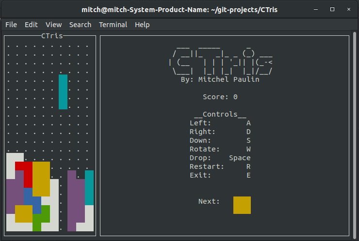
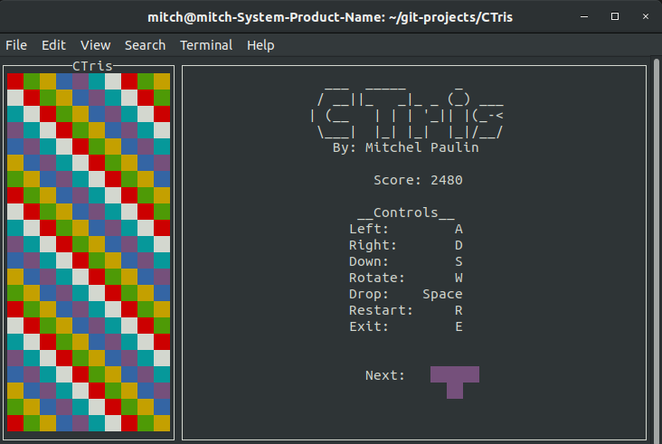

# CTris 
[](https://snapcraft.io/ctris)

[CTris](https://snapcraft.io/ctris) is a command line Tetris program written in C++. Made to work in the standard 80x24 terminal of most linux systems. Also works pretty well on the Windows Linux subsystem. Implemented custom rendering, collision detection and rotation algorithms.

You can install ctris directly from the snap store!

```bash
sudo snap install ctris
```

<p align="center">
  
</p>

<p align="center">
  
</p>

# Dependencies 

Install the ncurses lib
```bash
sudo apt-get install libncurses5-dev libncursesw5-dev
```

ncurses is a barebones API that allows you to write text-based user interfaces in a terminal-independent manner.

# Compiling

From the root folder run
```bash
make install DESTDIR=<destination>
```
